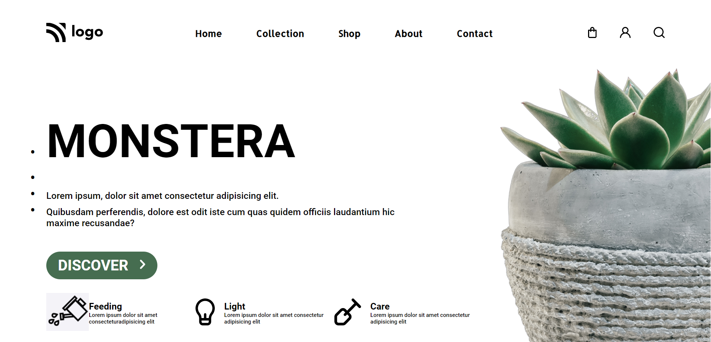

# Assignment 1

## Project 6 [Live Link](https://62e2b9e663dac343c9a6aa9b--monumental-cannoli-65f843.netlify.app/)

-   Skills Gained in this project
    -   Learned to use external fontawesome icon library.

---

## Time taken to finish this project

-   Approximately 5-6 hour taken to complete this one.

#### Screenshot

